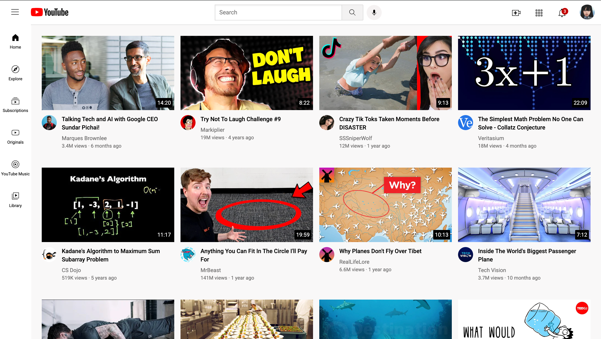

# 📺 YouTube Clone

## 🚀 Overview
This is a **YouTube Clone** built using **HTML and CSS**. The project focuses on replicating the basic layout and UI of YouTube, making it responsive across different screen sizes.

## 🛠️ Technologies Used
- **HTML5** – Structuring the webpage
- **CSS3** – Styling and layout (including Flexbox & Grid for responsiveness)

## 🎯 Features
✅ Responsive design with **Flexbox & Grid** for a seamless experience across devices
✅ Navbar with **YouTube-like UI**
✅ Video section with thumbnails, titles, and descriptions
✅ Sidebar with categories and navigation
✅ Search bar for UI enhancement
✅ Hover effects for an interactive feel

## 📂 Project Structure
```bash
📁 Youtube Clone
│── 📂 Images         # Images, icons, and other assets
│── youtube-clone.css            # Stylesheets
│── youtube-clone.html        # Main HTML file
```

## 📸 Screenshots


## 🚀 How to Run
1. **Clone the repository**
   ```bash
   git clone https://github.com/Snow-30/Youtube-clone.git
   ```
2. **Navigate to the project directory**
   ```bash
   cd Youtube-clone
   ```
3. **Open `youtube-clone.html` in your browser**

## 🔥 Future Enhancements
🔹 Add a **dark mode toggle** for better UX  
🔹 Implement **video player functionality using JavaScript**  
🔹 Improve the **search bar functionality**  

## 🤝 Contributing
If you'd like to improve this project, feel free to **fork** the repository and submit a pull request.

## 📞 Contact
For any queries, feel free to reach out:
- **GitHub**: [Snow-30](https://github.com/Snow-30)
- **Email**: snowyz3007@gmail.com
